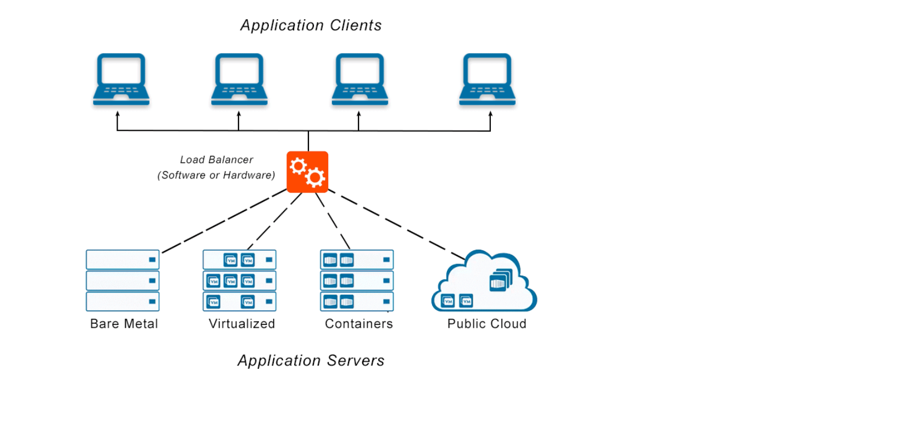
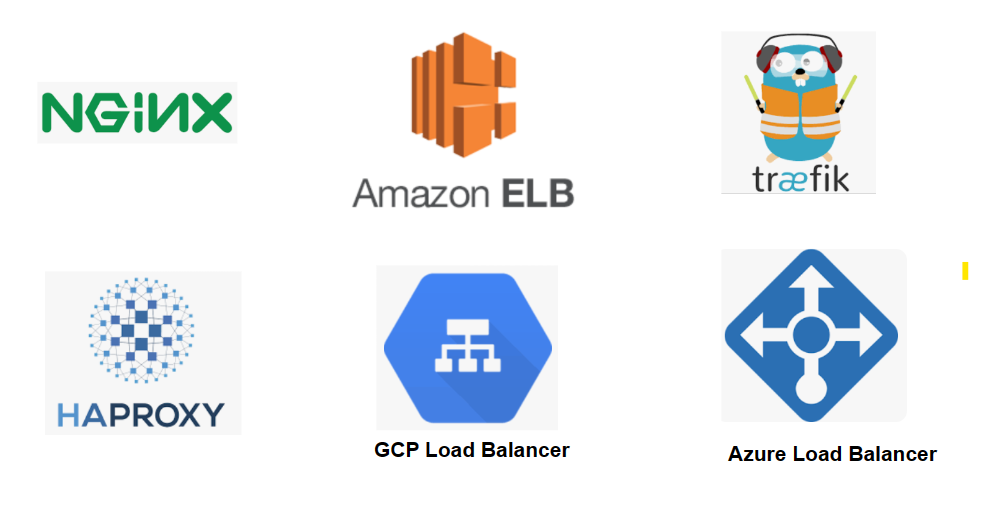

## What is Load Balancer

1) A load balancer is a networking device that helps distribute incoming network traffic across multiple servers or resources in a balanced manner, with the goal of optimizing resource utilization, maximizing throughput, minimizing response time, and avoiding overload on any individual resource. 

2) It acts as an intermediary between clients and servers, and ensures that each client request is routed to the appropriate server or resource based on factors such as server availability, capacity, and performance. 

3) Load balancing can improve the performance, availability, and scalability of a system or application by preventing any single server or resource from becoming a bottleneck or point of failure. 

4) Load balancers use a software program known as a reverse proxy to distribute incoming traffic across multiple servers that host the actual application. 

5) The reverse proxy software helps balance the load by directing traffic to the most available or best-performing server. 

6) This approach enhances the system's reliability and improves overall application performance.

## Load balancing algorithms :

1) **Round-robin**: This is a simple algorithm that evenly distributes requests among the available servers in a cyclic manner, where each server is used in turn.

2) **Least connections**: This algorithm routes traffic to the server with the least number of active connections at the time, ensuring that the load is spread evenly across all the servers.

3) **IP hash**: This algorithm assigns each client request to a server based on its IP address. This ensures that a specific client is always directed to the same server, which can help maintain session data and improve cache utilization.

4) **Random**: This algorithm randomly assigns requests to available servers, which can be useful for distributing traffic in situations where the load is not predictable or evenly distributed.

5) **Weighted round-robin**: This algorithm assigns a weight to each server based on its capacity or performance, with higher weight servers receiving a larger share of the traffic.

6) **Layer 4 vs Layer 7**: Load balancers can operate at different layers of the network stack. Layer 4 load balancing distributes traffic based on network protocols and addresses, while layer 7 load balancing distributes traffic based on application-level protocols and content. Layer 7 load balancing can be more granular and intelligent, but may also require more processing power.

These are just a few of the many load balancing strategies that can be used, and the choice of strategy will depend on the specific requirements and characteristics of the system or application being load balanced.

## Load Balancers available in market

## Horizontal scaling with a load balancer

- Suppose you have a web application that runs on a single server, and it's starting to experience increased traffic that's causing performance issues. You decide to horizontally scale the system by adding two more servers and a load balancer to distribute traffic across them.

- You set up the load balancer to distribute incoming traffic across the three servers using a round-robin algorithm. When a user requests the web application, the load balancer routes the request to one of the servers. The load balancer keeps track of the load on each server and routes traffic to the least busy server.

- As traffic continues to increase, you can add more servers to the system and configure the load balancer to distribute traffic across them. This allows you to scale the system as needed to handle increased traffic and workload.

- With horizontal scaling and a load balancer, you can improve the performance and reliability of your system, and ensure that it can handle increased traffic and workload without becoming overwhelmed.

## Summarize :

To recap, load balancer acts as a reverse proxy machine which selects one of the servers based on a chosen strategy for each incoming request. Although Round Robin is the most widely used strategy, other options are available. By implementing load balancers, your system can be made more resilient and scalable. Typically, each of your services would have a load balancer in front of them.